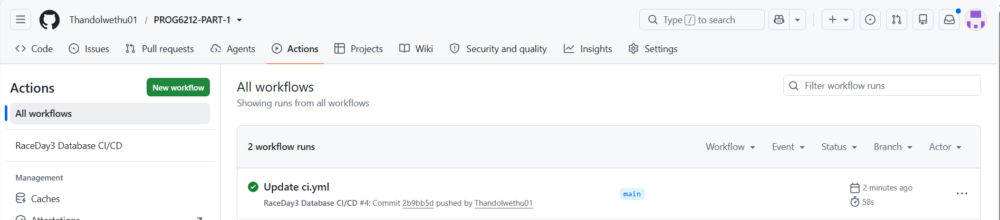

# 🏃‍♂️ RaceDay 3 - Full-Stack Database & API System

## 📌 Executive Overview

**RaceDay 3** is an end-to-end event management platform built for organizing athletic races (marathons, cycling tours, ultra-runs), managing participant registrations, and processing live race results 

The system brings together a **RESTful Web API layer**, a **relational SQL Server database**, and an **automated CI/CD testing pipeline**
